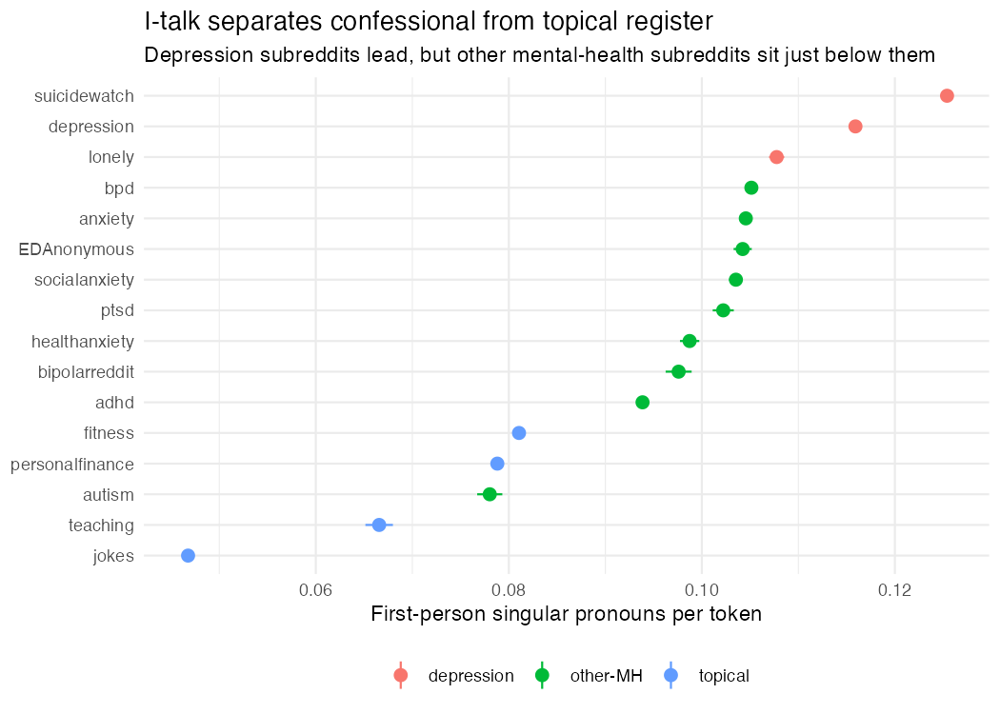

# Self-distancing, self-criticism, and the ought/ideal split in Reddit mental health text

Do linguistic markers of self-distancing and self-criticism track depressive symptoms, and
does the **ought**-self signal behave differently from the **ideal**-self signal?

Higgins' self-discrepancy theory predicts that ought-discrepancy produces anxiety and
ideal-discrepancy produces dejection. If those map onto separable linguistic signatures,
that is testable at scale. That was the target.

The main result concerns measurement rather than self-discrepancy theory.

A preregistered validation, 200 posts hand-coded blind, found that the self-criticism
dictionary works (precision 0.94) and the ought dictionary does not (precision 0.52, 95%
CI [0.374, 0.663]). The gate written into `PREREG.md` before any of this was run required
H2a be downgraded to exploratory if ought precision fell below .70. It did, so it was.

The cause is the choice of surface form. Self-criticism is built from content words
("failure", "worthless"), which are close to unambiguous. Ought is built from modal verbs
("have to", "need to", "should"), which in English cover an internalised standard, an
errand, a question, advice, and epistemic inference alike. Roughly half the flagged items
were errands rather than internalised standards: *"it's just medicine i
have to take everyday"*, *"i have to start the conversation"*.

The generalisable point is that lexical markers survive validation for content words and
fail for modal verbs. An internalised standard operationalised through modals of necessity
is partly a measure of scheduled tasks. Details in [`VALIDATION.md`](VALIDATION.md).

## Status

| Tier | What | State |
|---|---|---|
| 0 | Data audit, go or no-go | done |
| 1 | I-talk vs depression grouping | done, effect largely a register confound |
| 2 | Ought vs ideal double dissociation | **H2a exploratory** (measure failed validation); H2b stands |
| 3 | Within-person over time | done, effect was an arithmetic artifact |
| 4 | Dictionary validation | done, 200 items hand-coded, see `VALIDATION.md` |

No tier returned the result it was designed to test for. Each states why, in a form that
can be checked against the code. The preregistration, the validation threshold, and the
leave-one-out sensitivity checks were all fixed before the results existed, and each
changed a conclusion.

## Data

Reddit Mental Health Dataset, Low et al. 2020, *JMIR* 22(10):e22635.
Zenodo [10.5281/zenodo.3941387](https://zenodo.org/records/3941387), public domain, no
application needed. 28 subreddits, 4 time windows, 108 CSVs.

This repo uses 16 subreddits across 3 windows (2018, 2019, post = Jan to Apr 2020), for
**478,675 posts**. `data/` is gitignored. Nothing derived from raw text or usernames is
committed.

```sh
Rscript 00_download.R    # 47 files, ~1.2 GB, skips what you already have
```

Each CSV carries `subreddit, author, date, post` plus about 346 precomputed feature columns.

**Do not use the bundled `liwc_1st_pers` column.** On a r/depression post containing four
unambiguous first-person singular pronouns it reads 0, and its corpus mean is 0.47 per post
against a median post length of 140 words. Whatever it counts, it is not first-person
singular pronoun use. Every pronoun measure here is computed from raw text and checked
against the dataset's own tokenizer (`n_words`, agreement r = .9995).

## Run

```sh
Rscript 00_download.R   # ~1.2 GB from Zenodo
Rscript 01_audit.R      # go or no-go: confirms post/author/date columns exist
Rscript test_lexicons.R # 41 dictionary assertions
Rscript 02_features.R   # text to out/features.rds, the one expensive pass, ~3 min
Rscript 03_tier1.R      # Tier 1 results and figure
Rscript 04_tier2.R      # Tier 2 results
Rscript 06_tier3.R      # Tier 3 reduced, needs lme4
quarto render report.qmd
```

R 4.5, `data.table`, `stringi`, `ggplot2`, and `lme4` for Tier 3 only.

## Findings (Tier 1)

The result here is methodological and negative.

The obvious design is depression subreddits (depression, lonely, suicidewatch) against
non-mental-health ones (fitness, jokes, personalfinance, teaching). That gives **r = .47,
d = 1.08**. The meta-analytic I-talk effect is around r = .13. A number 3.5 times the
published effect is a red flag, not a discovery, and the preregistered `|r| > 0.3` gate in
the script aborted on it.

The gate was right, and the cause is confounded genre rather than a coding error. r/depression and
r/suicidewatch are communities whose norm is first-person confessional narrative.
r/personalfinance and r/teaching are topic-oriented Q&A. Any first-person pronoun measure
separates those registers whether or not anyone is depressed. Dropping r/jokes, the most
third-person control, barely moved it, which indicates the problem is the comparison arm
as a whole rather than one unrepresentative community.

Holding genre constant by comparing against other mental-health subreddits, where everyone
writes first-person distress narrative and only the disorder varies:

| Contrast | 2019 | 2018 | post (2020) |
|---|---|---|---|
| vs topical subreddits (confounded) | r = .472 | .489 | .490 |
| vs other mental-health (genre-matched) | **r = .211** | .224 | .223 |
| genre-matched, cross-arm authors removed | **r = .224** | .238 | .235 |

Stable across all three windows, so it is not a window artifact. 4.9% of authors post in
both arms. Removing them moves r *up* slightly, so that overlap was attenuating the
estimate rather than inflating it.

Roughly half the naive association is register rather than depression. The residual r ≈ .22 is
still above the r ≈ .13 literature, and I expect the rest is more of the same. Even within
mental-health subreddits, r/depression is more self-focused by topic than r/adhd. r/autism
landing down among the topical subreddits in the figure is the same thing from the other
side.



### What this number is not

It is not a replication of the r = .13 effect. Those estimates come from continuous
depression scales given to the same people who produced the language. This dataset has no
symptom measure at all, so the criterion here is subreddit membership, which is a different
and much cruder thing. Landing near .13 would have been a coincidence worth distrusting.
I have a DAIC-WOZ request out (PHQ-8 scored interview transcripts) for the severity version.

## Findings (Tier 2)

> **H2a is EXPLORATORY, not confirmatory.** `PREREG.md` required that downgrade if the
> ought dictionary scored below .70 precision against hand-coded posts. It scored **0.52**,
> with the whole 95% CI below the threshold. Every ought-based number in this section is
> therefore descriptive only, and the ought marker should be read as an unvalidated
> measure. H2b, which rests on the self-criticism dictionary, validated at **0.94** and
> stands. See [`VALIDATION.md`](VALIDATION.md).

Hypotheses are in `PREREG.md`, committed to git before `04_tier2.R` existed. The ordering
is verifiable in the history, not just asserted.

The test is a double dissociation between two families that are both first-person distress
narrative, so the Tier 1 register confound is held constant:

- **Agitation family:** anxiety, socialanxiety, healthanxiety
- **Dejection family:** depression, lonely, suicidewatch

Markers are restricted to first-person subjects. That matters more than any other design
choice here. *"You should see a doctor"* is a modal of obligation containing no ought self,
and support communities are full of it. Second and third-person modals are counted
separately and entered as a covariate.

| Marker | *d* (+ = higher in dejection) | OR for ≥1 occurrence |
|---|---|---|
| ought (self-directed obligation) | **−0.034** | 0.91 |
| ideal (counterfactual, unmet aspiration) | **+0.153** | 1.82 |
| self-criticism (FSCRS-seeded) | **+0.156** | 2.39 |

Both markers come from the same post, so the interaction is tested as a within-post
difference score, `delta = z(ideal) − z(ought)`. That avoids the correlated-rows problem a
stacked model would create. Higgins predicts delta is higher in the dejection family:

| Window | *d* for delta | 95% CI |
|---|---|---|
| 2019 (primary) | **0.134** | [0.163, 0.211] |
| 2018 (held out) | 0.130 | [0.153, 0.211] |
| 2020 (held out) | 0.123 | [0.149, 0.192] |

Direction holds in all three windows. The preregistered falsification condition, both
markers moving the same direction (which would mean generic distress rather than
self-discrepancy structure), did not occur. Robust to removing the 4.1% of authors who
appear in both families.

It leans on r/anxiety. Leave-one-subreddit-out puts delta in [0.090, 0.168], and the
low end is dropping r/anxiety, which takes it just below the preregistered SESOI of 0.10. No
single community reverses the sign, but one of six can push it under a threshold I set in
advance. That belongs in the summary, not a footnote.

### Caveats that matter more than the point estimate

The ought marker did not validate, at precision 0.52. This supersedes the caveats below:
the ought column is not a measure of self-directed obligation, so the dissociation reduces
to a claim resting on one validated marker and one unvalidated one. A double dissociation
requires both arms to be valid measures.

The asymmetry described below is consistent with that. The ought arm was the weaker one
throughout, and the validation result explains why.

The dissociation is asymmetric. The ought effect (*d* = −0.034) is below the preregistered SESOI of
0.10. It points the way Higgins predicts but cannot stand alone. The crossover is carried by
the ideal marker. That is weaker than a true double dissociation and I report it as such.

The unit of analysis is six communities rather than 197,106 posts. The post-level CIs are
hairline thin because *n* is huge, but they describe uncertainty about *these six
communities*. Treating each community as one observation, the exact permutation test gives
*p* = 0.10, which is the floor for a 3 vs 3 split, hit because the rank separation is
perfect:

| Family | Subreddit | mean delta |
|---|---|---|
| agitation | healthanxiety | −0.064 |
| agitation | socialanxiety | −0.088 |
| agitation | anxiety | −0.157 |
| dejection | lonely | +0.173 |
| dejection | suicidewatch | +0.082 |
| dejection | depression | +0.028 |

As strong as six communities can make it, which is not very strong.

Corrections went against the finding and it survived. Coding the validation sample
(`VALIDATION.md`) turned up four systematic error classes in the ought dictionary. Three are
fixed: `had to` catching past-tense external necessity ("i had to call the cops"), epistemic
`must` ("i must be underestimating myself" is an inference, not a duty), and
discourse-purpose statements ("i need to vent"). `had to` was in an early lexicon draft but
not in the preregistered pattern, so removing it restored the prereg definition rather than
tuning toward a result. Cumulatively the fixes moved delta *d* from 0.144 to 0.134. Applied
anyway.

Patching error classes was not sufficient. All 200 validation items were then hand-coded
blind: self-criticism precision 0.94, ought precision 0.52. The residual problem is the
choice of surface form rather than a list of remaining patches. See `VALIDATION.md`.

`test_lexicons.R` holds 41 assertions on the dictionaries, mostly that advice-giving does
not leak into the ought measure, which is the single confound this design rests on. Run it
before trusting any Tier 2 number.

## Findings (Tier 3, reduced)

The original design, mixed models on users with 5 or more posts spanning 30 or more days, is
impossible here. The release ships one post per author per subreddit-window. What exists is a
thin, irregular panel of authors appearing in more than one window, so observations about a
**year** apart.

**42,715 author-windows, 20,519 authors** with 2 or more windows, 1,677 with all three. All
predictors are person-mean-centred, so the estimates are within-person.

| Model | n | b | 95% CI |
|---|---|---|---|
| same window (negative control) | 42,715 | −0.000514 | [−0.00064, −0.00039] |
| naive lagged: distancing(t) to self-crit(t+1) | 19,343 | +0.000548 | [0.00035, 0.00075] |
| lagged, 3-window authors only | 3,354 | +0.000356 | [−0.00013, 0.00084] |

Within the same window, more self-distanced language goes with **less** self-criticism, the
direction the self-distancing literature predicts.

### The lagged result is an artifact, and catching it is the point

The naive lagged model flips sign and looks significant. It is arithmetic, not psychology.

91.8% of these authors have exactly two windows. For two observations, person-mean
centring forces `x_c = (d/2, −d/2)` and `y_c = (e/2, −e/2)`. The contemporaneous pair is
`(d/2, e/2)` and the lagged pair is `(d/2, −e/2)`, which is exactly the negative, by
construction, for every such author. So a lagged regression on two-observation people is
mechanically the mirror of the contemporaneous one and carries no information about time.

The script checks this numerically instead of asserting it. On two-window authors the
contemporaneous slope is −0.000589 and the lagged slope is +0.000604, a **ratio of −1.025**
against the −1.000 an exact artifact predicts.

Restricting the lag to authors seen in all three windows, where centring does not force a
reversal, gives an interval that **crosses zero**. Even that estimate carries small-T
dynamic panel (Nickell) bias.

The result is a within-person association in the same window, with no evidence of temporal
ordering.** The question that motivated Tier 3, whether self-distanced language shifts
before symptom language, needs days-to-weeks resolution. This panel is annual. It cannot
answer that, and no amount of modelling will make it.

## Limitations

Self-selected sample. No clinical diagnosis anywhere in the design. Subreddit membership is a
poor disorder proxy, and each community mixes people who are suffering, people supporting
someone else, and people who read for years before posting once. Everything is
correlational.

At n > 100k every p-value is below .001 and carries no information, so I report effect sizes
and CIs and leave p-values out. A smallest effect size of interest (|d| ≥ 0.10) was fixed
before estimation. The community-level permutation test is in there precisely because it
does not benefit from the large n.

Dictionary methods miss sarcasm, quotation, and negation, and cannot resolve coreference.
H2c (self-distancing via second and third-person self-reference) is exploratory for exactly
that reason: `you` cannot be separated from addressing the reader without coreference
resolution.

The four time windows are not a balanced panel, and the 2020 window overlaps the onset of
COVID-19, which changed both who posted and what they posted about.

Ethics: the data is public domain, but no post text or usernames are committed here. The
validation sample containing raw text is gitignored. Only aggregate results are published.

## Files

```
00_download.R   fetch the 47 CSVs this project uses
01_audit.R      go or no-go on the data release
lexicons.R      all regex patterns, shared by the pipeline and the tests
test_lexicons.R 41 assertions, run before trusting any Tier 2 number
02_features.R   text to per-post features, the only pass over raw text
03_tier1.R      Tier 1 estimation, robustness, figure
04_tier2.R      Tier 2 double dissociation and community-level permutation test
06_tier3.R      Tier 3 reduced: within-person panel and the centring-artifact check
05_validate.R   generates the hand-coding sample, --score computes precision
PREREG.md       Tier 2 hypotheses, committed before 04_tier2.R existed
VALIDATION.md   dictionary error classes found and fixed
TALK.md         the five-minute verbal version
report.qmd      the reproducible write-up
out/            results CSVs and figure (committed), features.rds (not)
```
